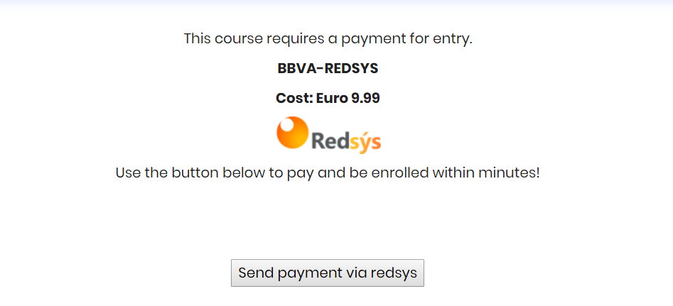

Moodle Enrollment Redsys 
===============================

Arrby Redsys Enrollment is an enrolment plugin that allow redsys payment.
Redsys is a payment gateway service from Spain.

Documentation
=============

Redsys main page
http://www.redsys.es/

Redsys API DOC
https://pagosonline.redsys.es/conexion-rest.html

This plugin use REDSYS API PHP version 1.0
https://pagosonline.redsys.es/descargas.html

Developed and maintained by
===========================
Hernan Arregoces
 - Software Engineer

Moodle profile: https://moodle.org/user/profile.php?id=1931915

Linkedin: https://www.linkedin.com/in/hernanarregoces/

Installation
------------

**First way**

- Clone this repository into the local folder.

**Second way**

- Download this repository
- Extract the content
- Put the folder into the local folder of your moodle
